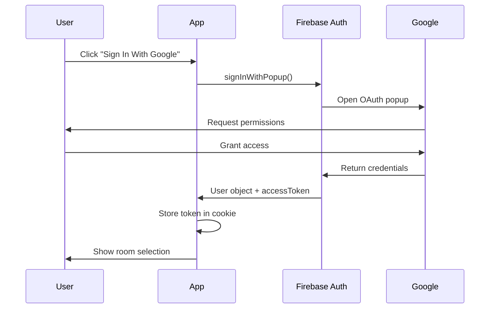
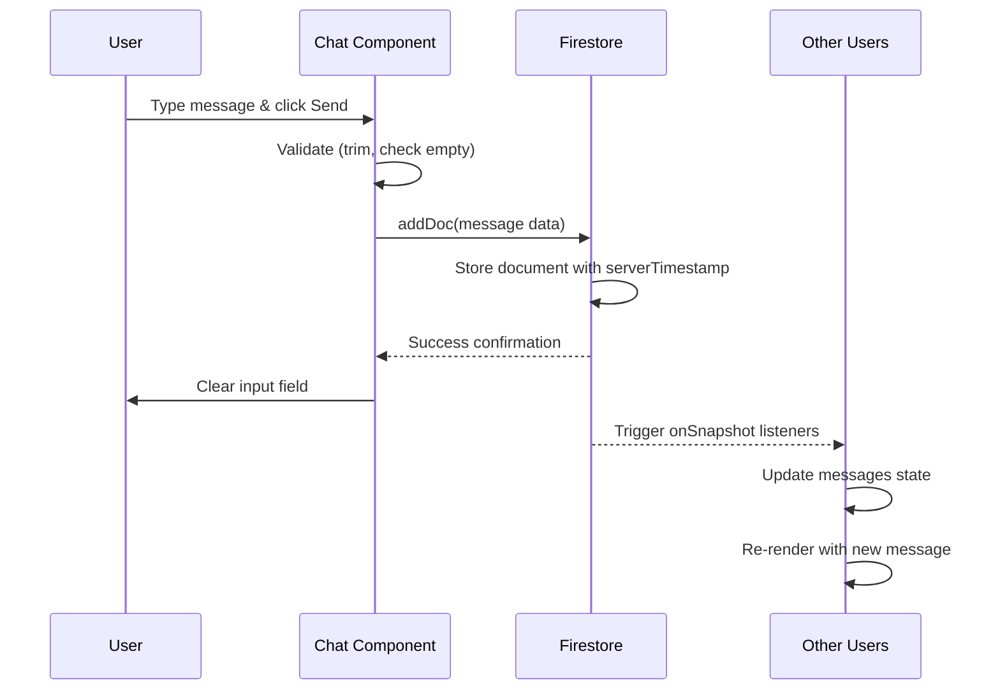

# 💬 Real-Time Chat Application

A modern, real-time chat application built with **React**, **Vite**, and **Firebase**. This application allows users to authenticate with Google, create or join chat rooms, and communicate in real-time with other users.


---

## 📋 Table of Contents

- [Features](#-features)
- [Technology Stack](#-technology-stack)
- [Project Structure](#-project-structure)
- [Getting Started](#-getting-started)
- [How It Works](#-how-it-works)
  - [Authentication Flow](#1-authentication-flow)
  - [Room Management](#2-room-management)
  - [Real-Time Messaging](#3-real-time-messaging)
- [Component Architecture](#-component-architecture)
- [Firebase Configuration](#-firebase-configuration)
- [Styling](#-styling)
- [Error Handling](#-error-handling)
- [Development](#-development)
- [Troubleshooting](#-troubleshooting)

---

## ✨ Features

### Core Functionality
- 🔐 **Google Authentication** - Secure sign-in with Google OAuth
- 💬 **Real-Time Messaging** - Instant message delivery and updates
- 🏠 **Multi-Room Support** - Create and join unlimited chat rooms
- 👥 **User Identification** - Display user names with each message
- ⏰ **Timestamps** - Show when each message was sent
- 🔄 **Live Updates** - Messages appear instantly without page refresh
- 🍪 **Persistent Sessions** - Stay logged in across browser sessions

### User Experience
- ⚡ **Fast Loading** - Optimized with Vite for quick startup
- 📱 **Responsive Design** - Works on desktop and mobile devices
- 🎨 **Clean UI** - Simple, intuitive interface
- ⚠️ **Error Messages** - Helpful feedback for issues
- 🚫 **Input Validation** - Prevents empty messages and limits length

---

## 🛠️ Technology Stack

### Frontend
- **React 19.1.1** - Modern UI library with hooks
- **Vite 7.1.6** - Next-generation frontend build tool
- **CSS3** - Custom styling with flexbox layouts

### Backend Services (Firebase)
- **Firebase Authentication** - Google OAuth integration
- **Cloud Firestore** - NoSQL real-time database
- **Firebase Analytics** - Usage tracking and insights

### Additional Libraries
- **universal-cookie 8.0.1** - Cookie management for auth persistence

### Development Tools
- **ESLint** - Code quality and consistency
- **@vitejs/plugin-react** - Hot Module Replacement (HMR)

---

## 📁 Project Structure

```
chat_app/
├── public/                      # Static assets
├── src/
│   ├── components/
│   │   ├── Auth.jsx            # Google authentication component
│   │   └── Chat.jsx            # Main chat room component
│   ├── styles/
│   │   └── Chat.css            # Chat-specific styles
│   ├── App.jsx                 # Root component with routing logic
│   ├── App.css                 # Global application styles
│   ├── main.jsx                # Application entry point
│   └── firebase-config.js      # Firebase initialization & config
├── index.html                   # HTML entry point
├── package.json                 # Dependencies and scripts
├── vite.config.js              # Vite configuration
└── eslint.config.js            # ESLint rules
```

---

## 🚀 Getting Started

### Prerequisites

- **Node.js** (v16 or higher)
- **npm** or **yarn**
- **Firebase Account** (free tier works)

### Installation

1. **Clone the repository**
   ```bash
   git clone <your-repo-url>
   cd chat_app
   ```

2. **Install dependencies**
   ```bash
   npm install
   ```

3. **Configure Firebase**
   
   - Go to [Firebase Console](https://console.firebase.google.com/)
   - Create a new project or use existing one
   - Enable **Authentication** → **Google Sign-In**
   - Enable **Firestore Database**
   - Copy your Firebase config and update `src/firebase-config.js`:

   ```javascript
   const firebaseConfig = {
     apiKey: "YOUR_API_KEY",
     authDomain: "YOUR_AUTH_DOMAIN",
     projectId: "YOUR_PROJECT_ID",
     storageBucket: "YOUR_STORAGE_BUCKET",
     messagingSenderId: "YOUR_MESSAGING_SENDER_ID",
     appId: "YOUR_APP_ID",
     measurementId: "YOUR_MEASUREMENT_ID"
   };
   ```

4. **Create Firestore Index**
   
   The app requires a composite index for efficient queries. You'll be prompted to create it when you first use the app, or create it manually:
   
   - Go to **Firestore** → **Indexes** → **Composite**
   - Add index with:
     - Collection: `messages`
     - Fields: `room` (Ascending), `createdAt` (Ascending)

5. **Start the development server**
   ```bash
   npm run dev
   ```

6. **Open your browser**
   
   Navigate to `http://localhost:5173`

---

## 🔍 How It Works

### 1. Authentication Flow

#### Initial Load
When the application starts, it checks for an existing authentication token:

```javascript
// App.jsx
const cookies = new Cookies()
const [isAuth, setIsAuth] = useState(cookies.get("auth-token"))
```

- **Token exists** → User is authenticated → Show room selection
- **No token** → Show Google sign-in screen

#### Google Sign-In Process



**Code Implementation (Auth.jsx):**
```javascript
const signInWithGoogle = async () => {
    try {
        const result = await signInWithPopup(auth, provider)
        cookies.set("auth-token", result.user.accessToken)
        setIsAuth(true)
    } catch (error) {
        console.error("Authentication error:", error);
    }
}
```

**Key Points:**
- Uses Firebase's `signInWithPopup()` for OAuth flow
- Stores `accessToken` in cookies for session persistence
- Updates `isAuth` state to trigger UI re-render

---

### 2. Room Management

#### How Rooms Work

**Important:** Rooms are **virtual** - they don't need to be pre-created. A room exists simply by using its name in Firestore queries.

#### Room Selection Flow

```javascript
// App.jsx
const [room, setRoom] = useState("")
const roomInputRef = useRef(null)

// User enters room name and clicks "Enter Chat"
<input ref={roomInputRef} />
<button onClick={() => setRoom(roomInputRef.current.value)}>
    Enter Chat
</button>
```

**What Happens:**
1. User types a room name (e.g., "general", "team-alpha")
2. Clicking "Enter Chat" updates the `room` state
3. App conditionally renders the `Chat` component:
   ```javascript
   {room ? <Chat room={room}/> : <RoomSelection />}
   ```
4. The `Chat` component receives the room name as a prop

#### Multiple Users in Same Room

When multiple users enter the same room name:
- They all query the same Firestore documents (filtered by `room` field)
- Real-time listeners ensure everyone sees the same messages
- No server-side room creation or management needed

**Example:**
- User A enters "general" → Sees messages where `room === "general"`
- User B enters "general" → Sees the same messages
- User C enters "private" → Sees different messages where `room === "private"`

---

### 3. Real-Time Messaging

#### Setting Up Real-Time Listener

When the `Chat` component mounts, it establishes a live connection to Firestore:

```javascript
// Chat.jsx
useEffect(() => {
    const queryMessages = query(
        messagesRef,
        where("room", "==", room),      // Filter by current room
        orderBy("createdAt")            // Sort chronologically
    );

    const unsubscribe = onSnapshot(
        queryMessages, 
        (snapshot) => {
            let messages = [];
            snapshot.forEach((doc) => {
                messages.push({ ...doc.data(), id: doc.id });
            });
            setMessages(messages);
            setLoading(false);
        },
        (error) => {
            setError(error.message);
        }
    );

    return () => unsubscribe();  // Cleanup on unmount
}, [room]);
```

**How `onSnapshot()` Works:**
- Creates a **persistent listener** to Firestore
- Fires **immediately** with existing data
- Fires **again** whenever data changes
- Automatically handles reconnections and network issues

#### Sending Messages

**Complete Message Flow:**



**Code Implementation:**

```javascript
const handleSubmit = async (e) => {
    e.preventDefault();
    
    // Validation
    const trimmedMessage = newMessage.trim();
    if (trimmedMessage === "") return;
    
    if (!auth.currentUser) {
        setError("User not authenticated");
        return;
    }

    // Send to Firestore
    try {
        await addDoc(messagesRef, {
            text: trimmedMessage,
            createdAt: serverTimestamp(),  // Server-side timestamp
            user: auth.currentUser.displayName || "Anonymous",
            room,  // Current room name
        });
        setNewMessage("");  // Clear input
    } catch (error) {
        setError("Failed to send message: " + error.message);
    }
}
```

#### Message Document Structure

Each message is stored in Firestore with this structure:

```javascript
{
    id: "auto-generated-document-id",
    text: "Hello, world!",
    createdAt: Timestamp(seconds: 1732557607, nanoseconds: 123456789),
    user: "John Doe",
    room: "general"
}
```

**Field Explanations:**
- `id` - Auto-generated by Firestore
- `text` - The message content (max 500 characters)
- `createdAt` - Server-side timestamp (ensures consistency across timezones)
- `user` - Display name from Google account
- `room` - Room identifier for filtering

#### Why Server Timestamps?

```javascript
createdAt: serverTimestamp()
```

**Benefits:**
- ✅ Consistent across all users regardless of timezone
- ✅ Prevents client-side time manipulation
- ✅ Ensures correct message ordering
- ✅ Handles clock skew between devices

---

## 🏗️ Component Architecture

### Component Hierarchy

```
App (Root Component)
│
├─── Auth Component (if !isAuth)
│    └─── Google Sign-In Button
│
└─── Authenticated View (if isAuth)
     │
     ├─── Room Selection (if !room)
     │    ├─── Room Input Field
     │    ├─── Enter Chat Button
     │    └─── Sign Out Button
     │
     └─── Chat Component (if room)
          ├─── Header (Room Name)
          ├─── Messages Container
          │    └─── Message List
          │         └─── Individual Messages
          │              ├─── User Name
          │              ├─── Message Text
          │              └─── Timestamp
          ├─── Message Input Form
          │    ├─── Text Input
          │    └─── Send Button
          └─── Action Buttons
               ├─── Leave Room
               └─── Sign Out
```

### Component Details

#### 1. **App.jsx** - Root Component

**Responsibilities:**
- Manage authentication state
- Handle room selection
- Coordinate between Auth and Chat components
- Provide sign-out functionality

**State Variables:**
```javascript
const [isAuth, setIsAuth] = useState(cookies.get("auth-token"))
const [room, setRoom] = useState("")
```

**Key Functions:**
- `handleSignOut()` - Signs out user and clears cookies

---

#### 2. **Auth.jsx** - Authentication Component

**Responsibilities:**
- Display sign-in interface
- Handle Google OAuth flow
- Store authentication token

**Props:**
- `setIsAuth` - Function to update parent's auth state

**Key Function:**
```javascript
const signInWithGoogle = async () => {
    const result = await signInWithPopup(auth, provider)
    cookies.set("auth-token", result.user.accessToken)
    setIsAuth(true)
}
```

---

#### 3. **Chat.jsx** - Main Chat Component

**Responsibilities:**
- Display chat room header
- Fetch and display messages in real-time
- Handle message sending
- Show loading and error states

**Props:**
- `room` - Current room name

**State Variables:**
```javascript
const [newMessage, setNewMessage] = useState("")      // Current input
const [messages, setMessages] = useState([])          // All messages
const [loading, setLoading] = useState(true)          // Loading state
const [error, setError] = useState(null)              // Error messages
```

**Key Functions:**
- `useEffect()` - Sets up Firestore listener
- `handleSubmit()` - Sends new messages

---

## 🔥 Firebase Configuration

### Services Used

#### 1. **Firebase Authentication**

```javascript
import { getAuth, GoogleAuthProvider } from "firebase/auth";

export const auth = getAuth(app);
export const provider = new GoogleAuthProvider();
```

**Usage:**
- `auth.currentUser` - Get currently signed-in user
- `signInWithPopup(auth, provider)` - Trigger Google sign-in
- `signOut(auth)` - Sign out current user

---

#### 2. **Cloud Firestore**

```javascript
import { getFirestore } from "firebase/firestore";

export const db = getFirestore(app);
```

**Collection Structure:**
```
messages (collection)
├── document-id-1
│   ├── text: "Hello!"
│   ├── createdAt: Timestamp
│   ├── user: "John Doe"
│   └── room: "general"
├── document-id-2
│   ├── text: "Hi there!"
│   ├── createdAt: Timestamp
│   ├── user: "Jane Smith"
│   └── room: "general"
└── ...
```

**Required Index:**
- Collection: `messages`
- Fields indexed: `room` (Ascending) + `createdAt` (Ascending)

---

#### 3. **Firebase Analytics**

```javascript
import { getAnalytics } from "firebase/analytics";

const analytics = getAnalytics(app);
```

Automatically tracks page views and user engagement.

---

## 🎨 Styling

### Design System

**Color Palette:**
- Primary Blue: `#3b5998` (buttons, headers)
- Error Red: `#ff4444` (sign out, errors)
- Neutral Gray: `#666` (leave room button)
- Light Gray: `#f5f5f5` (message backgrounds)

**Typography:**
- Font Family: `'Segoe UI', Tahoma, Geneva, Verdana, sans-serif`
- Header Size: `24px`
- Body Text: `16px`
- Timestamps: `0.8em`

### Layout Structure

**Chat Interface:**
```
┌─────────────────────────────────────┐
│  Welcome to: GENERAL                │ ← Header (fixed)
├─────────────────────────────────────┤
│                                     │
│  John: Hello everyone!              │
│  Jane: Hi John!                     │ ← Messages (scrollable)
│  Mike: Good morning!                │
│                                     │
├─────────────────────────────────────┤
│  [Type message...] [Send]           │ ← Input (fixed)
└─────────────────────────────────────┘
```

**Responsive Features:**
- Flexbox for flexible layouts
- 90% width container for readability
- Scrollable message area
- Fixed header and input form

---

## ⚠️ Error Handling

### Common Errors

#### 1. **Missing Firestore Index**

**Error Message:**
```
The query requires an index. You can create it here: [link]
```

**Solution:**
- Click the provided link in the error message
- Or manually create in Firebase Console
- Wait 2-5 minutes for index to build

---

#### 2. **Authentication Errors**

**Possible Causes:**
- User closes OAuth popup
- Network issues
- Firebase configuration errors

**Handling:**
```javascript
try {
    const result = await signInWithPopup(auth, provider)
    // Success
} catch (error) {
    console.error("Authentication error:", error);
    // Show user-friendly message
}
```

---

#### 3. **Message Send Failures**

**Validation Checks:**
- ✅ Message not empty (trimmed)
- ✅ User authenticated
- ✅ Message under 500 characters
- ✅ No errors present

**Code:**
```javascript
if (trimmedMessage === "") return;
if (!auth.currentUser) {
    setError("User not authenticated");
    return;
}
```

---

## 💻 Development

### Available Scripts

#### Development Server
```bash
npm run dev
```
- Starts Vite dev server
- Hot Module Replacement (HMR) enabled
- Default: `http://localhost:5173`

#### Production Build
```bash
npm run build
```
- Creates optimized bundle in `dist/`
- Minifies code
- Optimizes assets

#### Preview Production Build
```bash
npm run preview
```
- Serves production build locally
- Test before deployment

#### Lint Code
```bash
npm run lint
```
- Checks code quality
- Enforces ESLint rules

---

### Development Workflow

1. **Make Changes**
   - Edit files in `src/`
   - Changes auto-reload with HMR

2. **Test Locally**
   - Use `npm run dev`
   - Test in multiple browsers
   - Test with multiple users (different browsers/incognito)

3. **Build for Production**
   - Run `npm run build`
   - Check for build errors
   - Test with `npm run preview`

4. **Deploy**
   - Deploy `dist/` folder to hosting service
   - Options: Firebase Hosting, Vercel, Netlify, etc.

---

## 🐛 Troubleshooting

### Issue: Messages not appearing

**Possible Causes:**
1. Missing Firestore index
2. Incorrect room name
3. Network issues

**Solutions:**
- Check browser console for errors
- Create required Firestore index
- Verify Firebase configuration
- Check internet connection

---

### Issue: Authentication not persisting

**Possible Causes:**
1. Cookies disabled
2. Incognito/private mode
3. Cookie expiration

**Solutions:**
- Enable cookies in browser
- Use normal browsing mode
- Check cookie settings in `Auth.jsx`

---

### Issue: Real-time updates not working

**Possible Causes:**
1. Firestore listener not set up
2. Network disconnection
3. Firebase quota exceeded

**Solutions:**
- Check `useEffect` cleanup function
- Verify internet connection
- Check Firebase usage limits

---

## 📚 Key Concepts

### React Hooks Used

#### `useState`
```javascript
const [messages, setMessages] = useState([])
```
Manages component state (messages, loading, errors, etc.)

#### `useEffect`
```javascript
useEffect(() => {
    // Set up Firestore listener
    return () => unsubscribe();  // Cleanup
}, [room]);
```
Handles side effects (Firestore listeners, subscriptions)

#### `useRef`
```javascript
const roomInputRef = useRef(null)
```
Direct access to DOM elements (input fields)

---

### Firebase Concepts

#### Real-Time Listeners
```javascript
onSnapshot(query, callback, errorCallback)
```
- Persistent connection to Firestore
- Automatic updates when data changes
- Must be unsubscribed to prevent memory leaks

#### Server Timestamps
```javascript
serverTimestamp()
```
- Generated on Firebase servers
- Consistent across all clients
- Prevents time manipulation

#### Queries
```javascript
query(collection, where(...), orderBy(...))
```
- Filter documents by field values
- Sort results
- Requires indexes for complex queries

---

## 🚀 Future Enhancements

Potential features to add:

- [ ] **User Avatars** - Display profile pictures
- [ ] **Message Editing** - Edit sent messages
- [ ] **Message Deletion** - Delete own messages
- [ ] **Typing Indicators** - Show when users are typing
- [ ] **Read Receipts** - Show message read status
- [ ] **File Sharing** - Upload images/files
- [ ] **Emoji Support** - Emoji picker
- [ ] **Private Messages** - Direct messaging
- [ ] **User Presence** - Online/offline status
- [ ] **Message Search** - Search chat history
- [ ] **Dark Mode** - Theme toggle
- [ ] **Notifications** - Browser notifications for new messages

---

## 📄 License

This project is open source and available under the [ISC License](LICENSE).

---

## 🤝 Contributing

Contributions are welcome! Please feel free to submit a Pull Request.

---

## 📞 Support

If you encounter any issues or have questions:

1. Check the [Troubleshooting](#-troubleshooting) section
2. Review [Firebase Documentation](https://firebase.google.com/docs)
3. Check [React Documentation](https://react.dev)
4. Open an issue on GitHub

---

**Built with ❤️ using React, Vite, and Firebase**
